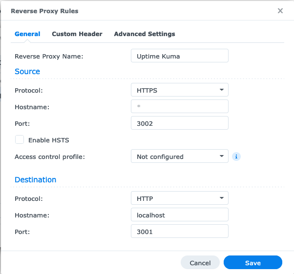

In order to expose Uptime Kuma to the web securely, it is recommended to proxy it behind a traditional webserver such as nginx or Apache. Below are some example configurations that you could use.

Unlike other web apps, Uptime Kuma is based on WebSocket. You need two more headers **"Upgrade"** and **"Connection"** in order to **reverse proxy WebSocket**.

Uptime Kuma **does not support a subdirectory** such as `http://example.com/uptimekuma`. Please prepare a domain or sub-domain to do that.

- [Nginx](#nginx)
- [Apache](#apache)
- [Caddy](#caddy)
- [Caddy with Docker-Compose](#caddy-with-docker-compose)
- [Https-Portal](#https-portal)
- [Nginx Proxy Manager](#nginx-proxy-manager)
- [Synology Builtin Reverse Proxy](#synology-builtin-reverse-proxy)
- [Traefik](#Traefik)
- [Cloudflare](#cloudflare)
- [Cloudflare Tunnels](#cloudflare-tunnels)
- [OpenLiteSpeed](#openlitespeed)
- [HAProxy](#haproxy)
- Others
  - [SSL/HTTPS](#sslhttps)


# Nginx

With SSL:
```nginx
server {
  listen 443 ssl http2;
  #listen [::]:443 ssl http2;
  server_name sub.domain.com;
  ssl_certificate     /path/to/ssl/cert/crt;
  ssl_certificate_key /path/to/ssl/key/key;

  location / {
    proxy_set_header   X-Real-IP $remote_addr;
    proxy_set_header   X-Forwarded-For $proxy_add_x_forwarded_for;
    proxy_set_header   Host $host;
    proxy_pass         http://localhost:3001/;
    proxy_http_version 1.1;
    proxy_set_header   Upgrade $http_upgrade;
    proxy_set_header   Connection "upgrade";
  }
}
```

Without SSL:
```nginx
server  {
    listen 80;
    #listen [::]:80;
    server_name    sub.domain.com;
    location / {
        proxy_pass         http://localhost:3001;
        proxy_http_version 1.1;
        proxy_set_header   Upgrade $http_upgrade;
        proxy_set_header   Connection "upgrade";
        proxy_set_header   Host $host;
    }
}
```

# Apache
With SSL:
```apache
<VirtualHost *:443>
  ServerName sub.domain.com
  SSLEngine On
  SSLCertificateFile /path/to/ssl/cert/crt
  SSLCertificateKeyFile /path/to/ssl/key/key
  # Protocol 'h2' is only supported on Apache 2.4.17 or newer.
  Protocols h2 http/1.1

  ProxyPass / http://localhost:3001/
  RewriteEngine on
  RewriteCond %{HTTP:Upgrade} =websocket
  RewriteRule /(.*) ws://localhost:3001/$1 [P,L]
  RewriteCond %{HTTP:Upgrade} !=websocket
  RewriteRule /(.*) http://localhost:3001/$1 [P,L]
</VirtualHost>
```

Without SSL:
```apache
<VirtualHost *:80>
  ServerName sub.domain.com

  ProxyPass / http://localhost:3001/
  RewriteEngine on
  RewriteCond %{HTTP:Upgrade} websocket [NC]
  RewriteCond %{HTTP:Connection} upgrade [NC]
  RewriteRule ^/?(.*) "ws://localhost:3001/$1" [P,L]
</VirtualHost>
```

# Caddy

```nginx
subdomain.domain.com {
    reverse_proxy 127.0.0.1:3001
}
```

# Caddy with Docker-compose

If you run Uptime Kuma using Docker-Compose and don't already have a reverse proxy, this is a simple way to configure Caddy. You only need to replace 'status.example.org' with your domain.

```yml
version: '3'
networks:
  default:  
    name: 'proxy_network'
services:
  uptime-kuma:
    image: louislam/uptime-kuma:1
    restart: unless-stopped
    volumes:  
      - /srv/uptime:/app/data
    labels:   
      caddy: status.example.org
      caddy.reverse_proxy: "* {{ '{{upstreams 3001}}'}}"
  caddy:
    image: "lucaslorentz/caddy-docker-proxy:ci-alpine"
    ports:    
      - "80:80" 
      - "443:443"
    volumes:  
      - /var/run/docker.sock:/var/run/docker.sock:ro
      - /srv/caddy/:/data
    restart: unless-stopped
    environment:
      - CADDY_INGRESS_NETWORKS=proxy_network
```

# Https-Portal

Enabling "WEBSOCKET=true", or the equivalent in your docker environment variables will do the trick.  
Link to https-portal Websocket under [Advanced Usage](https://github.com/SteveLTN/https-portal#configure-nginx-through-environment-variables).

Example docker-compose.yml file using Https-Portal:

```
version: '3.3'

services:
  https-portal:
    image: steveltn/https-portal:1
    ports:
      - '80:80'
      - '443:443'
    links:
      - uptime-kuma
    restart: always
    environment:
      DOMAINS: 'status.domain.com -> http://uptime-kuma:3001'
      STAGE: 'production' # Don't use production until staging works
      # FORCE_RENEW: 'true'
      WEBSOCKET: 'true'
    volumes:
      - https-portal-data:/var/lib/https-portal

  uptime-kuma:
    image: louislam/uptime-kuma:1
    container_name: uptime-kuma
    volumes:
      - ./uptime-kuma:/app/data
    ports:
      - 3001:3001

volumes:
  https-portal-data:
```
Only change "status.domain.com" to your domain

# Nginx Proxy Manager

Please enable "WebSockets Supports"


# Synology Builtin Reverse Proxy


1. Bind IP to localhost when starting Kuma

```bash
docker run -d --restart=always -p 127.0.0.1:3002:3001 -v uptime-kuma:/app/data --name uptime-kuma louislam/uptime-kuma:1
```

2. On your NAS, open *Control Panel* and then *Login Portal* 
3. Click on *Advanced*
4. Open *Reverse Proxy* 
5. Create a new Entry with the following values:



# Traefik
```
labels:
    - "traefik.enable=true"
    - "traefik.http.routers.uptime-kuma.rule=Host(`YourOwnHostname`)"
    - "traefik.http.routers.uptime-kuma.entrypoints=https"
    - "traefik.http.routers.uptime-kuma.tls=true"
    - "traefik.http.routers.uptime-kuma.tls.certresolver=myresolver"
    - "traefik.http.services.uptime-kuma.loadBalancer.server.port=3001"
```
Add the above to your `docker-compose.yml` file and replace "YourOwnHostname" with the hostname you want to use. When setup correctly, Traefik can automatically get a Let’s Encrypt certificate for your service.

# Cloudflare

You must enable "WebSockets" in Cloudflare Dashboard:

Cloudflare Dashboard -> Network -> Enable WebSockets

Read more:
https://github.com/louislam/uptime-kuma/issues/138#issuecomment-890485229

# Cloudflare Tunnels

It is the easiest way in my opinion.

Read more: https://github.com/louislam/uptime-kuma/wiki/Reverse-Proxy-with-Cloudflare-Tunnel

# OpenLiteSpeed

Create a new virtual host through the graphical admin like you normally would.

**Basic tab**
- Name: `uptime-kuma`
- Virtual Host Root:	`/path/to/uptime-kuma`
- Enable Scripts/ExtApps:	`Yes`

**External app tab**
- Add a `web server` app type
- Name: `uptime-kuma`
- Address:	`http://localhost:3001`

**Context tab**

- Add a `proxy` context
- URI:	`/`
- Web Server:	`[VHost Level]: uptime-kuma`
- Header Operations:
  ```
  Upgrade websocket
  Connection upgrade
  ```
- Access Allowed:	`*`

**Web Socket Proxy tab**

- Add a `Web Socket Proxy Setup`
- URI:	`/`
- Address: `127.0.0.1:3001`

**SSL tab (if needeed)**

- Private Key File: `/path/to/ssl/key/privkey.pem`
- Certificate File: `/path/to/ssl/cert/fullchain.pem`
- Chained Certificate: `yes`

Perform a graceful restart and launch uptime-kuma.

# HAProxy

No special configuration is required when using HAProxy as a reverse
proxy although you may wish to add the `timeout tunnel` option to either
the `defaults`, `listen`, or `backend` sections. If using the `timeout
tunnel` option, it is also recommended to set `timeout client-fin` to
handle instances where the client stops responding. 

Read more: 
http://cbonte.github.io/haproxy-dconv/2.4/configuration.html#4.2-timeout%20tunnel

# Others

## SSL/HTTPS

It is recommended to use SSL (HTTPS) with your web-server to avoid MiTM attacks when on a public network. If using caddy these certificates will be auto-generated and updated.

If using Apache or NGINX, it is recommended to use CertBot to manage SSL for free, it uses Let’s Encrypt to get it’s certificates and keeps them renewed. You can also use your own certificates and place them as shown above. If using CertBot use the "Without SSL" settings and then run certbot on it and it will automatically configure auto-HTTPS redirection.
